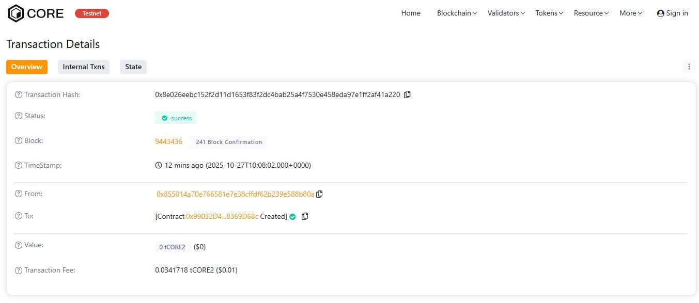

# HashNexus

## Project Description
**HashNexus** is a blockchain-based document verification system that allows users to securely store and validate the authenticity of digital documents using their cryptographic hashes. It eliminates the need for third-party verification by providing a decentralized proof of existence for any file.

## Project Vision
The vision of **HashNexus** is to build a **trustless, transparent, and permanent** record-keeping system where individuals and organizations can verify document authenticity directly on the blockchain — ensuring **integrity**, **ownership**, and **immutability**.

## Key Features
- 🧩 **Document Hash Registration**: Users can register a unique hash of any document.
- 🔍 **Instant Verification**: Anyone can verify if a document exists and view its registration details.
- 🔐 **Ownership Tracking**: Each document is linked to the wallet address that registered it.
- ⏱️ **Timestamp Proof**: The blockchain timestamp acts as verifiable proof of document creation time.

## Future Scope
- 🌐 Integration with IPFS for decentralized file storage.
- 📄 Support for digital signatures and certificates.
- 🧠 Incorporation of AI-based document similarity detection to prevent duplicate records.
- 🪙 Token-based incentive system for document authenticity validation.
- 🔗 Cross-chain verification across multiple blockchain networks.

---

### 🧠 Tech Stack
- **Language:** Solidity (`^0.8.20`)
- **Framework:** Hardhat or Remix
- **Network:** Ethereum / Polygon Testnet

---

### 🧪 How to Deploy (Using Remix)
1. Open [Remix IDE](https://remix.ethereum.org/).
2. Create a new file `Project.sol` and paste the above code.
3. Compile using Solidity version `0.8.20`.
4. Deploy the contract using any test network (e.g., Remix VM or MetaMask connected to Sepolia testnet).

---

**Project Name:** HashNexus  
**License:** MIT

H address:0x8e026eebc152f2d11d1653f83f2dc4bab25a4f7530e458eda97e1ff2af41a220
